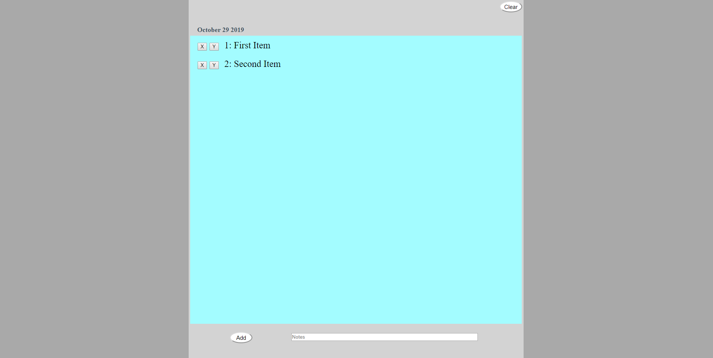

# ToDo-List

## Description: A todo list that gets saved in the local storage and that has the current date on the top-left

## How it is organaize:
### You write in the input towards the bottom
### You click Add
### Click on the x to delete and the y to mark as completed

## How to run the app:
### 1. Git clone this repo
### 2. open index.html in your browser

### You can view the app here
### https://armjim14.github.io/ToDo-List/

## Home page

